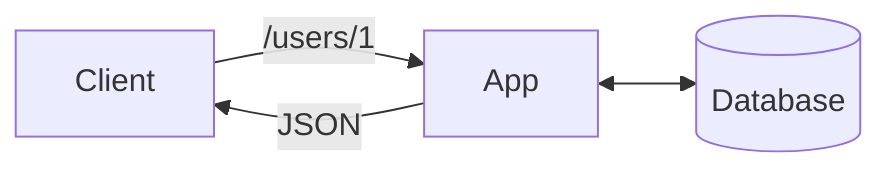

[Retail AI Adventurers Advent Calendar 2023](https://qiita.com/advent-calendar/2023/rai-adventurers) の投稿です。

https://qiita.com/advent-calendar/2023/rai-adventurers

[Retail AI](https://www.retail-ai.jp) は、[トライアルカンパニー](https://www.trial-net.co.jp) を軸とした小売におけるお客様の買い物体験の向上を目指す企業です。

この投稿では、本業（SRE）のかたわらで取り組む Backend Tech Stack について書きます。

題材は、「Rust Rocket[^2] と async[^6] について」です。

Rocket が `v0.5`[^5] で async に対応しました ‼️

> Rocket's core request handling was rebuilt in v0.5 to take advantage of the latest async networking facilities in Rust. Backed by tokio, Rocket automatically multiplexes request handling across async tasks on all of the available cores on the machine. As a result, route handlers can now be declared async and make use of await syntax:
>
> Rocket のコアのリクエスト処理は、Rust の最新の非同期ネットワーク機能を利用するためにv0.5で再構築されました。tokio によってバックアップされた Rocket は、マシン上で利用可能なすべてのコアの非同期タスク間でリクエスト処理を自動的に多重化します。その結果、ルートハンドラを非同期で宣言し、await 構文を利用できるようになりました：

さらに詳しく見たい方は読み続けてください。

## tl;dr
* Rocket `v0.5`[^5] が 2023年11月に  stable になりました。
* async が追加されました。
* Rocket は、入門者や中規模向けです。

https://rocket.rs/v0.5/news/2023-11-17-version-0.5/

## About Rust Rocket
Rust Rocket[^2] は、Rust の Web Framework の 1 つです。

https://rocket.rs/

Rust の Web Framework には、他にも Axum[^1] など複数の選択肢があります。

:::details Axum と Rocket に関する GPT-4 の解説
> RustでのWebフレームワークであるAxumとRocketについて、それぞれの違いを説明します。
> 1. Axum
>    * 開発元: AxumはTokioプロジェクトによって開発されています。
>    * アーキテクチャ: Axumは非同期プログラミングを中心に設計されており、Tokioエコシステムと深く統合されています。これにより高いパフォーマンスと効率が期待できます。
>    * ルーティング: Axumでは、関数型プログラミングスタイルの強力なルーティング機能があります。これは、シンプルで読みやすいAPI設計を可能にします。
>    * 柔軟性: Axumはカスタマイズ性と拡張性に優れており、さまざまなミドルウェアやプラグインを組み込むことができます。
>    * 使用ケース: 高パフォーマンスかつ拡張性の高いアプリケーション開発に適しています。
> 1. Rocket
>    * 開発元: Rocketは独立したコミュニティベースのプロジェクトです。
>    * アーキテクチャ: Rocketは、安全性と使いやすさに焦点を当てた設計です。これにより、開発者はRustの型システムを利用して、安全かつ効率的なWebアプリケーションを構築できます。
>    * ルーティング: Rocketのルーティングは、属性ベースで直感的に記述できます。これにより、コードの可読性と保守性が向上します。
>    * 簡潔性と生産性: Rocketは、多くの機能が組み込まれており、開発者が素早く効率的にアプリケーションを構築できるように設計されています。
>    * 使用ケース: 特に入門者や中規模のプロジェクトに適しており、Rustの型安全性を活用した開発を行いたい場合に適しています。
> * 総括
>    * パフォーマンスと拡張性: Axumは非同期プログラミングとTokioエコシステムへの深い統合により、高いパフォーマンスと拡張性を提供します。
>    * 安全性と使いやすさ: Rocketは、Rustの型システムを最大限に利用することで、安全性と使いやすさを重視した設計です。
>    * 適用範囲: Axumは大規模かつパフォーマンスが求められるアプリケーション、Rocketは入門者や中規模アプリケーションに適しています。
> 
> どちらを選ぶかは、プロジェクトの要件や個人の好みによって異なります。
:::

* Axum: 
大規模かつパフォーマンスが求められるもの向け。
* Rocket: 
入門者や中規模向け。

要件にあわせて選択しましょう。

## Syntax
それでは実装を見ていきます。

今回実装しているのは、ユーザー情報を database から取得する REST API です。



```rust: routes.rs
#[get("/users/<user_id>")]
pub async fn user_handler(user_id: i64, user_service: &State<Arc<UserService>>) -> (Status, (ContentType, Json<Option<User>>)) {
    match user_service.fetch_user(user_id).await {
        Ok(user) => (Status::Ok, (ContentType::JSON, Json(user))),
        Err(_) => (Status::InternalServerError, (ContentType::JSON, Json(None))),
    }
}
```

```bash: log
vscode ➜ /workspaces/rust-api-samples-rocket/rocket (main) $ cargo run
    Finished dev [unoptimized + debuginfo] target(s) in 0.44s
     Running `target/debug/rocket`
🔧 Configured for debug.
   >> address: 127.0.0.1
   >> port: 8000
   >> workers: 8
   >> max blocking threads: 512
   >> ident: Rocket
   >> IP header: X-Real-IP
   >> limits: bytes = 8KiB, data-form = 2MiB, file = 1MiB, form = 32KiB, json = 1MiB, msgpack = 1MiB, string = 8KiB
   >> temp dir: /tmp
   >> http/2: true
   >> keep-alive: 5s
   >> tls: disabled
   >> shutdown: ctrlc = true, force = true, signals = [SIGTERM], grace = 2s, mercy = 3s
   >> log level: normal
   >> cli colors: true
   >> secret key: [generated]
Warning: secrets enabled without a stable `secret_key`
   >> disable `secrets` feature or configure a `secret_key`
   >> this becomes an error in non-debug profiles
📬 Routes:
   >> (user_handler) GET /users/<user_id>
📡 Fairings:
   >> Shield (liftoff, response, singleton)
🛡️ Shield:
   >> X-Content-Type-Options: nosniff
   >> X-Frame-Options: SAMEORIGIN
   >> Permissions-Policy: interest-cohort=()
🚀 Rocket has launched from http://127.0.0.1:8000
```

### データ共有の方法
Connection Pool などインスタンス化したものの受け渡しについてです。

- Axum:
`layer` method を使用します。

```rust: main.rs
#[tokio::main]
async fn main() {
    dotenv().ok();
    let key = "DATABASE_URL".to_string();
    let database_url = env::var(key).expect("Failed to set environment variables");
    let pool = SqlitePool::connect(&database_url)
        .await
        .expect("Failed to connect database.");
    let user_service = Arc::new(UserService::new(pool));
    let app = Router::new().route("/users/:user_id", get(user_handler))
        .layer(Extension(user_service));    // 👈 Here
    let listener = tokio::net::TcpListener::bind("0.0.0.0:8000")
        .await.unwrap();
    axum::serve(listener, app).await.unwrap();
}
```

- Rocket:
`manage`[^3] method を使用します。

https://rocket.rs/v0.5/guide/state/#managed-state

```rust: main.rs
#[launch]
async fn rocket() -> _ {
    dotenv().ok();
    let key = "DATABASE_URL".to_string();
    let db_url = env::var(key).expect("Failed to set environment variables.");
    let pool = SqlitePool::connect(&db_url).await.expect("Failed to connect database.");
    let user_service = Arc::new(UserService::new(pool));
    rocket::build()
        .manage(user_service)    // 👈 Here
        .mount("/", routes![user_handler])
}
```

### Requests and Responses
- Axum:
path を main の router で定義します。

https://docs.rs/axum/latest/axum/extract/struct.MatchedPath.html

```rust: main.rs
    let app = Router::new().route("/users/:user_id", get(user_handler))    // 👈 Here
        .layer(Extension(user_service));
```

```rust: routes.rs
pub async fn user_handler(Path(user_id): Path<i64>, Extension(user_service): Extension<Arc<UserService>>) -> (StatusCode, Json<Option<User>>) {
    match user_service.fetch_user(user_id).await {
        Ok(user) => (StatusCode::OK, Json(user)),
        Err(_) => (StatusCode::INTERNAL_SERVER_ERROR, Json(None)),
    }
}
```

- Rocket:
path を handler 側で定義します。
> **Dynamic Paths**[^4]
You can declare path segments as dynamic by using angle brackets around variable names in a route's path. For example, if we want to say Hello! to anything, not just the world, we can declare a route like so:

```rust: routes.rs
#[get("/users/<user_id>")]    // 👈 Here
pub async fn user_handler(user_id: i64, user_service: &State<Arc<UserService>>) -> (Status, (ContentType, Json<Option<User>>)) {
    match user_service.fetch_user(user_id).await {
        Ok(user) => (Status::Ok, (ContentType::JSON, Json(user))),
        Err(_) => (Status::InternalServerError, (ContentType::JSON, Json(None))),
    }
}
```

今回のコードはこちら。

https://github.com/danny-yamamoto/rust-api-samples-rocket

Rust Rocket `v0.5` に関する検証は以上です。

この投稿をみて何か得られた方は、いいね ❤️ をお願いします。

それでは、次回のアドカレでお会いしましょう。👋

[^1]: https://github.com/tokio-rs/axum
[^2]: https://rocket.rs/
[^3]: https://rocket.rs/v0.5/guide/state/#managed-state
[^4]: https://rocket.rs/v0.5/guide/requests/#dynamic-paths
[^5]: https://rocket.rs/v0.5/news/2023-11-17-version-0.5/
[^6]: あるタスクが完了するのを待たずに、他のタスクを実行できるようにするプログラミングの手法です。例えば、Web アプリケーションでデータベースから情報を取得する際、同期的な処理だとデータが返ってくるまでユーザーインターフェースが固まってしまう可能性があります。しかし、非同期処理を使うことで、そのデータが読み込まれている間も他の操作が可能になり、よりスムーズなユーザーエクスペリエンスを提供できます。
